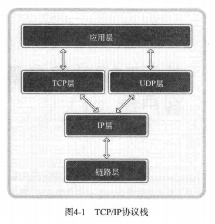
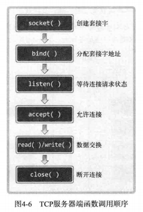
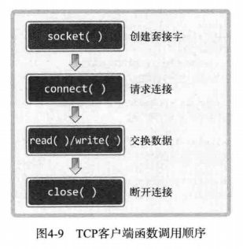
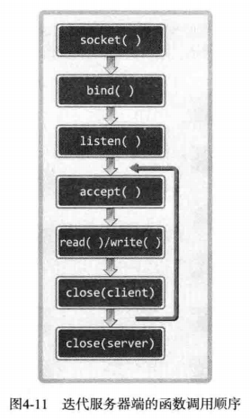

# 1 理解TCP和UDP

TCP/IP协议栈：



 # 2 实现基于TCP的服务器端/客户端







## 2.1 进入等待连接请求状态

```c
//成功返回0，失败返回-1
//backlog: 连接请求等待队列的长度
int listen(int sock, int backlog);
```

## 2.2 受理客户端连接请求

```c
//成功返回创建的套接字文件描述符，失败返回-1
int accept(int sock, struct sockaddr *addr, socklen_t *addrlen);
```

## 2.3 迭代回声服务器端/客户端

运行方式：

- 服务器端在同一时刻只与一个客户端相连，并提供回声服务
- 服务器端依次向5个客户端提供服务并退出
- 客户端接收用户输入的字符串并发送到服务器端
- 服务器端将接收的字符串数据传回客户端。即“回声”
- 服务器端与客户端之间的字符串回声一直执行到客户端输入Q为止

代码见echo_server.c和echo_client.c

以上实现的客户端违反了TCP没有数据边界的传输特性。如果数据太大，服务端可能把数据分成多个数据包发送到客户端，在此过程中，客户端可能在尚未收到全部数据包时就调用read函数。

# 3 回声客户端的完美实现

代码见echo_client2.c
