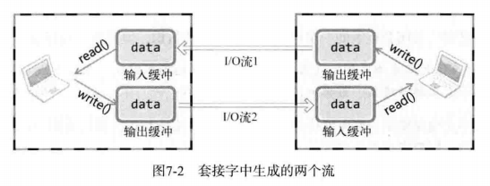

# 1 基于TCP的半关闭

单方面断开连接会导致无法接收另一主机传输的数据，因此有了半关闭方法

半关闭是指可以传输数据但无法接收，或可以接收但无法传输

## 1.1 套接字和流



两台主机通过套接字连接后会建立两个流，分别进行输入和输出。close函数会同时断开两个流，显得不够优雅

## 1.2 针对优雅断开的shutdown函数

```c
/*
 * sock 	需要断开的套接字文件描述符
 * howto	传递断开方式信息
 *	SHUT_RD 	断开输入流
 *	SHUT_WR 	断开输出流
 *	SHUT_RDWR	同时断开I/O流
 * 成功返回0，失败返回-1
 */
int shutdown(int sock, int howto);
```

代码见file_server.c/file_client.c