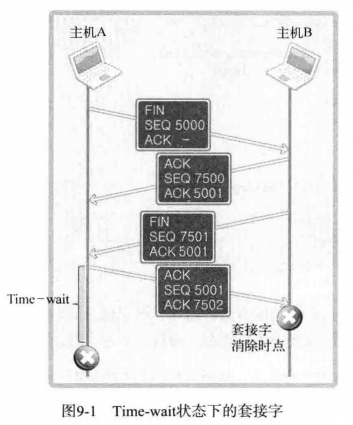
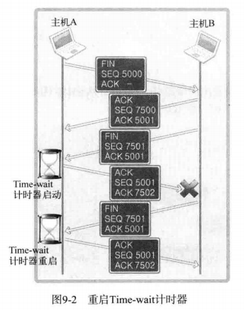
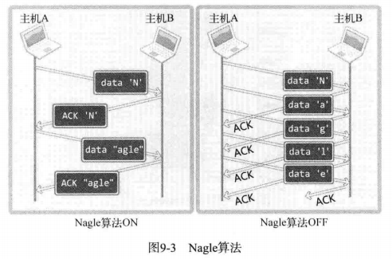

# 1 套接字可选项和I/O缓冲大小

## 1.1 套接字多种可选项

|   协议层    |      选项名       | 读取 | 设置 |
| :---------: | :---------------: | :--: | :--: |
| SOL_SOCKET  |     SO_SNDBUF     |  O   |  O   |
|             |     SO_RCVBUF     |  O   |  O   |
|             |   SO_REUSEADDR    |  O   |  O   |
|             |   SO_KEEPALIVE    |  O   |  O   |
|             |   SO_BROADCAST    |  O   |  O   |
|             |   SO_DONTROUTE    |  O   |  O   |
|             |   SO_OOBINLINE    |  O   |  O   |
|             |     SO_ERROR      |  O   |  X   |
|             |      SO_TYPE      |  O   |  X   |
| IPPROTO_IP  |      IP_TOS       |  O   |  O   |
|             |      IP_TTL       |  O   |  O   |
|             | IP_MULTICAST_TTL  |  O   |  O   |
|             | IP_MULTICASR_LOOP |  O   |  O   |
|             |  IP_MULTICAST_IF  |  O   |  O   |
| IPPROTO_TCP |   TCP_KEEPALIVE   |  O   |  O   |
|             |    TCP_NODELAY    |  O   |  O   |
|             |    TCP_MAXSEG     |  O   |  O   |

## 1.2 getsockopt & setsockopt

```c
#include<sys/socket.h>

/* 
 * sock		用于查看选项套接字的文件描述符
 * level	要查看的可选项的协议层
 * optname	要查看的可选项名
 * optval	保存查看结果的缓冲地址值
 * optlen	向第四个参数optval传递的缓冲大小。调用函数后，
 * 		  该变量中保存通过第四个参数返回的可选项信息的字节数
 * 成功返回0，失败返回-1
 */
int getsockopt(int sock, int level, int optname, void *optval, socklen_t *optlen);

// 成功返回0，失败返回-1
int setsockopt(int sock, int level, int optname, const void *optval, socklen_t optlen);
```

代码见sock_type.c

## 1.3 SO_SNDBUF & SO_RCVBUF

获得和修改输入输出缓冲大小

代码见get_buf.c/set_buf.c

# 2 SO_REUSEADDR

## 2.1 发生地址分配错误（Binding Error）



以之前的方式运行服务器端然后强制关闭服务器端，再次运行服务器端会输出bind() error。这是因为服务器端先断开连接后要进入Time-wait状态（4次挥手），所以无法立即重新运行。

客户端也有Time-wait状态但不需要考虑的原因是客户端的端口号是随机指定的，不存在占用的问题。

Time-wait状态存在的原因是确保ACK已经被对方接收

## 2.2 地址再分配



Time-wait状态有时会导致难以尽快重启服务器端以提供服务的问题，更改套接字选项中SO_REUSEADDR的状态，可将Time-wait状态下的套接字端口号重新分配给新的套接字。

# 3 TCP_NODELAY

## 3.1 Nagle算法



只有收到前一数据的ACK消息时，Nagle算法才发送下一数据。

不使用Nagle算法可以提高传输速度，但会增加过多的网络流量。例如对大文件数据应禁用Nagle算法。

```c
// 禁用Nagle算法
int opt_val = 1;
setsockopt(sock, IPPROTO_TCP, TCP_NODELAY, (void*)&opt_val, sizeof(opt_val));

// 查看Nagle算法的设置状态,使用opt_val保存0，禁用保存1
int opt_val;
socklen_t opt_len;
opt_len = sizeof(opt_val);
getsockopt(sock, IPPROTO_TCP, TCP_NODELAY, (void*)&opt_val, &opt_len);
```

