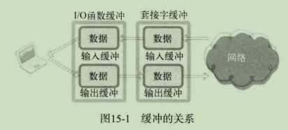

# 1 标准I/O函数的优点

- 标准I/O函数具有良好的移植性
- 标准I/O函数可以利用缓冲提高性能

创建套接字时，操作系统将生成用于I/O的缓冲。此时若使用标准I/O函数，将得到额外的另一缓冲的支持。



**套接字缓冲**：主要是为了实现TCP协议而设立。例如TCP传输中丢失数据时将再次传递，重传的数据则保存在套接字的输出缓冲中。

**标准I/O函数缓冲**：为了提高性能。确实快。

标准I/O函数的**缺点**：

- 不容易进行双向通信
- 有时可能频繁调用fflush函数
- 需要以FILE结构体指针的形式返回文件描述符

# 2 使用标准I/O函数

## 2.1 利用fdopen函数转换为FILE结构体指针

```c
#include<stido.h>

/*
 * params:
 * 		fildes		需要转换的文件描述符
 * 		mode		将要创建的FILE结构体指针的模式信息(r/w)
 * return:	成功返回转换的FILE结构体指针，失败返回NULL
 */
FILE* fdopen(int fildes, const char *mode);
```

## 2.2 利用fileno函数转换为文件描述符

```c
#include<stido.h>

 // return:	成功返回转换后的文件描述符，失败返回-1
int fileno(FILE *stream);
```

# 3 基于套接字的标准I/O函数使用

