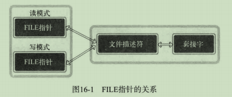
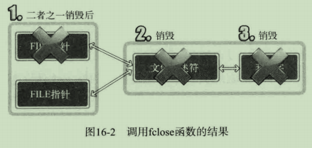
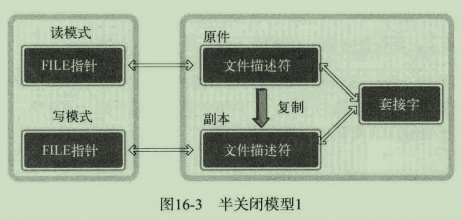
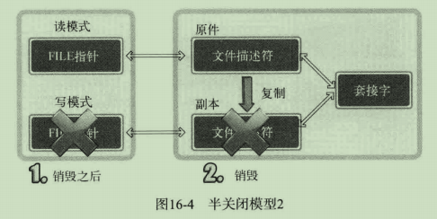
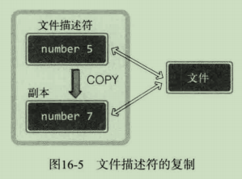

# 1 分离I/O流

之前使用过两种方法分离过I/O流。第一种是“TCP I/O过程分离”，这种方法通过调用fork函数复制出1哥文件描述符，以区分输入和输出中使用的文件描述符。第二种是上一章通过2次fdopen函数的调用，创建读模式FILE指针和写模式FILE指针。

## 1.1 分离流的好处

第一种：

- 通过分开输入过程和输出过程降低实现难度
- 与输入无关的输出操作可以提高速度

第二种：

- 为了将FILE指针按读模式和写模式加以区分
- 可以通过区分读写模式降低实现难度
- 通过区分I/O缓冲提高缓冲性能

## 1.2 流分离带来的EOF问题

使用FILE指针分离I/O流时调用fclose函数关闭一个指针不会达到半关闭的效果，而是将套接字完全终止。

# 2 文件描述符的复制和半关闭

## 2.1 终止流时无法半关闭的原因





如何使用FILE指针进入半关闭状态？





现在是半关闭状态吗？不是，该文件描述符仍然可以同时进行I/O，而且此时也没有发送EOF。现在只是为半关闭状态准备好了环境。

## 2.2 复制文件描述符

区别于fork函数复制整个进程，此处的复制是在同一进程中进行的。可以看到文件描述符的整数值是不同的。



```c
#include<unistd.h>

// 成功返回复制的文件描述符，失败返回-1
int dup(int fildes);
// fildes2: 明确指定的文件描述符整数值
int dup2(int fildes, int fildes2);
```

## 2.3 复制文件描述符后流的分离

