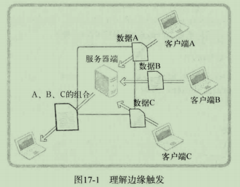

# 1 epoll理解及应用

select复用方法由来已久，并不适用于如今需要同时接入上百个客户端的需求，也就不适合以Web服务器端开发为主流现代开发环境，因此需要使用Linux平台下的epoll。

## 1.1 基于select的I/O复用技术速度慢的原因

- 调用select函数后常见的针对所有文件描述符的循环语句
- 每次调用select函数时都需要向该函数传递监视对象信息

其中第二点，当应用程序向操作系统传递数据将对程序造成很大负担，而且服务通过优化代码解决，因此成为性能上的致命弱点。

这种缺点可以通过如下方式**弥补**：仅向操作系统传递1次监视对象，监视范围或内容发生变化时只通知发生变化的事项。Linux的方式是epoll，Windows的方式是IOCP。

select也有**优点**：兼容性更好

## 1.2 实现epoll时必要的函数和结构体

函数：

- epoll_create：创建保存epoll文件描述符的空间
- epoll_ctl：向空间注册并注销文件描述符
- epoll_wait：与select函数类似，等待文件描述符发生变化

```c
// 通过如下结构体将发生事件的文件描述符单独集中到一起
struct epoll_event
{
    __uint32_t events;
    epoll_data_t data;
}

typedef union epoll_data
{
    void *ptr;
    int fa;
    __uint32_t u32;
    __uint64_t u64;
} epoll_data_t;
```

```c
#include<sys/epoll.h>

// 成功返回epoll文件描述符，失败返回-1
// Linux内核会忽略size建议的epoll例程大小，真正的epoll例程大小由操作系统决定
int epoll_create(int size);

/*
 * params:
 * 		epfd: 用于注册监视对象的epoll例程的文件描述符
 *		op: 用于指定监视对象的添加、删除或更改等操作
 *		fd: 需要注册的监视对象文件描述符
 *		event: 监视对象的事件类型
 * return: 成功返回0，失败返回-1
 */
int epoll_ctl(int epfd, int op, int fd, struct epoll_event *event);
```

|      op       |                  作用                  |
| :-----------: | :------------------------------------: |
| EPOLL_CTL_ADD |      将文件描述符注册到epoll例程       |
| EPOLL_CTL_DEL |      从epoll例程中删除文件描述符       |
| EPOLL_CTL_MOD | 更改注册的文件描述符的关注事件发生情况 |

epoll_event示例：

```c
struct epoll_event event;
....
event.events = EPOLLIN;	// 发生需要读取数据的事件时
event.data.fd = sockfd;
epoll_ctl(epfd, EPOLL_CTL_ADD, sockfd, &event);
....
```

|  EPOLL事件   |                             含义                             |
| :----------: | :----------------------------------------------------------: |
|   EPOLLIN    |                      需要读取数据的情况                      |
|   EPOLLOUT   |             输出缓冲为空，可以立即发送数据的情况             |
|   EPOLLPRI   |                      收到OOB数据的情况                       |
|  EPOLLRDHUP  |      断开连接或半关闭的情况，这在边缘触发方式下非常有用      |
|   EPOLLERR   |                        发生错误的情况                        |
|   EPOLLET    |                 以边缘触发的方式得到事件通知                 |
| EPOLLONESHOT | 发生一次事件后，相应文件描述符不再收到事件通知。因此需要向epoll_ctl函数的第二个参数传递EPOLL_CTL_MOD，再次设置事件。 |

```c
#include<sys/epoll.h>

/*
 * params:
 * 		epfd: 表示事件发生监视范围的epoll例程的文件描述符
 *		events: 保存发生事件的文件描述符集合的结构体地址值
 *		maxevents: 第二个参数中可以保存的最大事件数
 *		timeout: 以1/1000秒为单位的等待时间，传递-1时，一直等待直到发生事件
 * return: 成功返回0，失败返回-1
 */
int epoll_ctl(int epfd, struct epoll_event *event, int maxevents, int timeout);

int event_cnt;
struct epoll_event *ep_events;
....
ep_events = malloc(sizeof(struct epoll_event)*EPOLL_SIZE);
....
event_cnt = epoll_wait(epfd, ep_events, EPOLL_SIZE, -1);
....
```

## 1.3 基于epoll的回声服务器端

代码见echo_epollserv.c

# 2 条件触发和边缘触发

**条件触发**：只要输入缓冲有数据就会一直注册该事件

**边缘触发**：仅注册一次该事件

## 2.1 边缘触发的服务器端实现中必知的两点

- 通过errno变量验证错误原因
- 为了完成非阻塞I/O，更改套接字特性

引入 error.h 头文件得到全局变量errno记录错误信息

```c
#include<fcntl.h>

/*
 * params:
 *		filedes: 属性更改目标的文件描述符
 *		cmd: 表示函数调用的目的
 * return: 成功返回cmd参数相关值
 */
int fcntl(int filedes, int cmd, ...);

/* 将文件改为非阻塞模式 */
// 获取之前设置的属性信息
int flag = fcntl(fd, F_GETFL, 0);
// 在之前设置的基础上添加非阻塞标志
fcntl(fd, F_SETFL, flag|O_NONBLOCK)
```

fcntl具有可变参数的形式。

cmd参数：

- F_GETFL: 获得第一个参数所指的文件描述符属性
- F_SETFL: 更改文件描述符的属性

## 2.2 边缘触发和条件触发孰优孰劣

边缘触发可以分离接收数据和处理数据的时间点



假设需要客户端ABC按顺序发送数据到服务器端，然后服务器端将ABC数据发送给接收客户端。如果客户端ABC能按序连接并传输数据，而且接收客户端提前等待，则服务器端的实现很简单。但是实际情况客户端ABC不一定何时连接到服务器端，也有可能乱序发送数据，或者接收客户端还未连接。在这种情况下，条件触发可以区分数据接收和处理，使服务器端的实现更灵活。