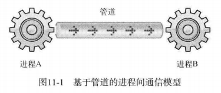
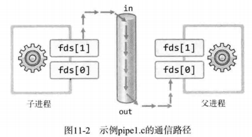
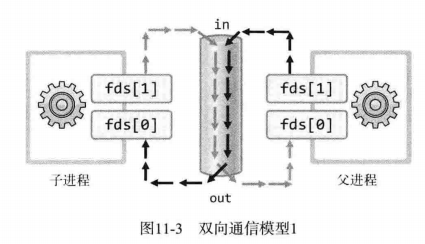
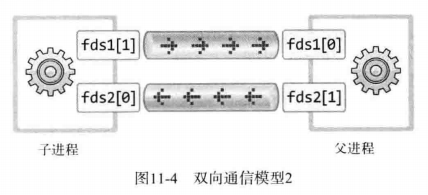

# 1 进程间通信的基本概念

通过fork函数创建的子进程不会与父进程共享内存空间，因此进程间通信只能通过其他特殊方法完成。

## 1.1 通过管道实现进程间通信




管道和套接字一样是属于操作系统的资源，不是fork函数的复制对象（套接字描述符是进程的资源，会被复制），所以两个进程可以通过管道通信。

```c
#include<unistd.h>

/*
 * filedes[0]	通过管道接收数据时使用的文件描述符，即管道出口
 * filedes[1]	通过管道传输数据时使用的文件描述符，即管道入口
 * 成功返回0，失败返回1
 */
int pipe(int filedes[2]);
```

代码见pipe1.c



## 1.2 通过管道进行进程间双向通信



使用上图模型需要注意，向管道传递数据时，先读的进程会把数据取走。因此使用一个管道进行双向通信很难完美实现，不过可以创建2个通道。



代码见pipe2.c/pipe3.c

# 2 运用进程间通信

扩展回声服务器端，使其能够将客户端传输的字符串按序保存到文件中

代码见echo_storeserv.c