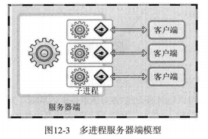
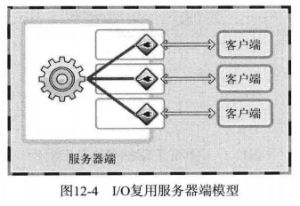
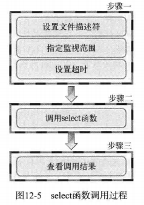
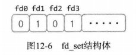
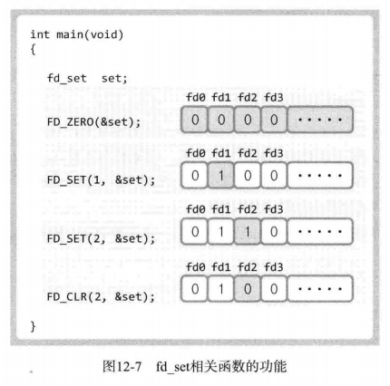
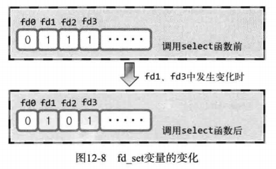

# 1 基于I/O复用的服务器端

## 1.1 多进程服务器端的缺点和解决方法

由于每个进程都具有独立的内存空间，因此创建进程需要大量的运算和内存空间，相互间的数据交换也要采用相对复杂的方法（IPC方法）。

## 1.2 复用

**复用**：为了提高物理设备的效率，用最少的物理要素传递最多数据时使用的技术





I/O复用服务器端的进程需要确认收到数据的套接字，并通过举手的套接字接收数据。

# 2 理解select函数并实现服务器端

select函数监视的事件：

- 是否存在套接字接收数据
- 无需阻塞传输数据的套接字有哪些
- 那些套接字发生了异常



## 2.1 设置文件描述符

利用select函数可以同时监视多个文件描述符，文件描述符在这里也可以视为套接字。首先需要将要监视的文件描述符集中到一起，按照监视项（接收、传输、异常）进行区分。使用fd_set数组变量执行此操作。



上图最左端的位表示文件描述符0，如果该位设置为1，则表示该文件描述符是监视对象。fd_set变量中注册或更改的操作都由下列宏完成：

- FD_ZERO(fd_set *fdset)：将fd_set变量的所有位初始化为0
- FD_SET(int fd, fd_set *fdset)：在参数fdset指向的变量中注册文件描述符f的信息
- FD_CLR(int fd, fd_set *fdset)：在参数fdset指向的变量中清除文件描述符f的信息
- FD_ISSET(int fd, fd_set *fdset)：若参数fdset指向的变量中包含文件描述符fd的信息，则返回“真”



## 2.2 设置监视范围及超时

```c
#include<sys/select.h>
#include<sys/time.h>

/*
 * maxfd		监视对象文件描述符数量
 * readset		将所有关注“是否存在待读取数据”的文件描述符注册到fd_set型变量，并传递其地址值
 * writeset		将所有关注“是否可传输无阻塞数据”的文件描述符注册到fd_set型变量，并传递其地址值
 * exceptset	将所有关注“是否发生异常”的文件描述符注册到fd_set型变量，并传递其地址值
 * timeout		调用select函数后，为防止陷入无限阻塞的状态，传递超时（time-out）信息
 * 返回值	发生错误返回-1，超时返回时返回0.因发生关注的事件返回时，返回大于0的值，该值是发生事件的文件描述符数
 */
int select(int maxfd, fd_set *readset, fd_set *writeset, fd_set *exceptset, const struct timeval *timeout);
```

文件描述符的监视范围与select函数的maxfd参数有关，只需将最大的文件描述符值加1再传递到select函数即可。

```c
struct timeval
{
    long tv_sec;	//seconds
    long tv_usec;	//microseconds
}
```

## 2.3 调用select函数后查看结果



select函数调用完成后，fd_set变量为1的所有位均变为0，但发生变化的文件描述符对应位除外，因此上图fd1和fd3发生了变化。

## 2.4 select函数示例

```c
#include<stdio.h>
#include<unistd.h>
#include<sys/time.h>
#include<sys/select.h>
#define BUF_SIZE 30

int main(int argc, char *argv[])
{
    fd_set reads, temps;
    int result, str_len;
    char buf[BUF_SIZE];
    struct timeval timeout;
    FD_ZERO(&reads);
    FD_SET(0, &reads);	// 0 is standard input(console)

    /*
    不能在此时设置超时，因为每次调用select函数后timeval结构体成员都会被替换为超时前剩余时间，因此需要在每次调用select函数前都进行初始化
    timeout.tv_sec = 5;
    timeout.tv_usec = 5000;
    */

    while (1)
    {
        // 因为调用select函数后除发生变化的文件描述符对应位外，剩下的所有位将初始化为0，为了记住初始值，需要将reads内容复制到temps
        // 这是使用select函数的通用方法
        temps = reads;
        timeout.tv_sec = 5;
        timeout.tv_usec = 0;
        result = select(1, &temps, 0, 0, &timeout);
        if (result == -1)
        {
            puts("Select() error!");
            break;
        }
        else if (result == 0)
        {
            puts("Time-out");
        }
        else
        {
            if (FD_ISSET(0, &temps))
            {
                str_len = read(0, buf, BUF_SIZE);
                buf[str_len] = 0;
                printf("message from console: %s", buf);
            }
        }
    }
   return 0;
}
```

## 2.5 实现I/O服用服务器端

代码见echo_selectserv.c