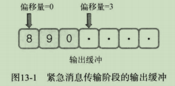
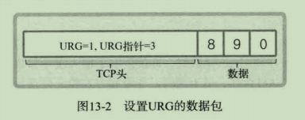
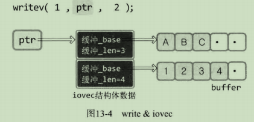

之前Linux都使用read&write函数完成数据I/O，Windows使用send&recv。本章Linux将使用send&recv函数，并展示其优点，还将介绍其他几种I/O函数。

# 1 send&recv函数

```c
#include<sys/socket.h>

/*
 * params:
 * 		sockfd	表示与数据传输对象的连接的套接字文件描述符
 * 		buf		保存待传输数据的缓冲地址值
 * 		nbytes	待传输的字节数
 * 		flags	传输数据时指定的可选项信息
 * return: 成功返回发送的字节数，失败返回-1
 */
ssize_t send(int sockfd, const void *buf, size_t nbytes, int flags);

// return: 成功返回接收的字节数（收到EOF时返回0），失败返回-1
ssize_t recv(int sockfd, void *buf, size_t nbytes, int flags);
```

| 可选项（Option） |                        含义                        | send | recv |
| :--------------: | :------------------------------------------------: | :--: | :--: |
|     MSG_OOB      |        用于传输带外数据（out-of-band data）        |  ·   |  ·   |
|     MSG_PEEK     |          验证输入缓冲中是否存在接收的数据          |      |  ·   |
|  MSG_DONTROUTE   | 数据传输过程中不参照路由表，在本地网络中寻找目的地 |  ·   |      |
|   MSG_DONTWAIT   |       调用I/O函数时不阻塞，用于使用非阻塞I/O       |  ·   |  ·   |
|   MSG_WAITALL    |       防止函数返回，直到接收全部请求的字节数       |      |  ·   |

<center>send&recv函数的可选项及含义</center>

## 1.1 MSG_OOB：发送紧急消息

带外数据就是紧急消息，需要创建特殊的传送方法和通道以发送。

代码见oob_recv.c/oob_send.c

再看**带外数据**：通过完全不同的通信路径传输的数据。但TCP不另外提供单独的通信路径传输数据，只会利用TCP的**紧急模式**进行传输。





紧急消息的效果是督促消息处理，仍会保证数据的传输顺序。

但在我的实验中，紧急消息确实会先传，但只传递一位？

## 1.2 检查输入缓冲

同时设置MSG_PEEK选项和MSG_DONTWAIT选项，以验证输入缓冲中是否存在接收的数据。设置MSG_PEEK选项并调用recv函数时，即使读取了输入缓冲的数据也不会删除。因此，该选项通常与MSG_DONTWAIT合作，用于调用以非阻塞方式验证待读数据存在与否的函数。

代码见peek_recv.c/peek_send.c

## 2 readv&writev函数

readv&writev函数：对数据进行整合传输及发送的函数，即writev函数将分散保存在多个缓冲中的数据一并发送，readv函数可以由多个缓冲分别接收。因此可以减少I/O函数的调用次数。

```c
#include<sys/uio.h>

/*
 * params:
 *		filedes	表示数据传输对象的套接字文件描述符。但该函数不只限于套接字，可以像read函数一样向其传递文件或标准输出描述符
 *		iov		iovec结构体数组的地址值，结构体iovec中包含带发送数据的位置和大小信息
 *		iovcnt	向第二个参数传递的数组长度
 * return: 成功返回发送的字节数，失败返回-1
 */
ssize_t writev(int filedes, const struct iovec *iov, int iovcnt);

struct iovec
{
    void *iov_base;	 // 缓冲地址
    size_t iov_len；	// 缓冲大小
}

/*
 * params:
 *		filedes	传递接收数据的文件（或套接字）描述符
 *		iov		iovec结构体数组的地址值，结构体iovec中包含带发送数据的位置和大小信息
 *		iovcnt	向第二个参数传递的数组长度
 * return: 成功返回接收的字节数，失败返回-1
 */
ssize_t readv(int filedes, const struct iovec *iov, int iovcnt);
```



