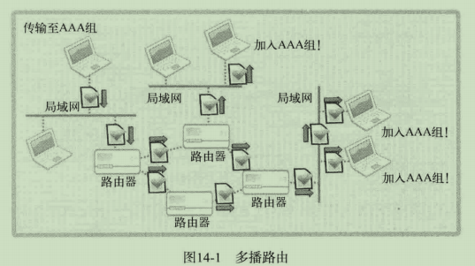
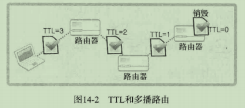

# 1 多播

多播方式的数据传输是基于UDP完成的。UDP数据传输以单一目标进行，而多播数据同时传递到加入（注册）特定组的大量主机。

**D类IP地址**（**224.0.0.1—239.255.255.254**）是专门用于多点广播的。

## 1.1 多播的数据传输方式及流量方面的优点

多播的数据传输特点：

- 多播服务器端针对特定多播组，只发送1次数据
- 即使只发送1次数据，但该组内的所有客户端都会接收数据
- 多播组数可在IP地址范围内任意增加
- 加入特定组即可接收发往该多播组的数据



多播主要用于“多媒体数据的实时传输”

## 1.2 路由和TTL，以及加入组的方法

传递多播数据包必须设置TTL，即生存时间，它是决定“数据包传递距离”的主要因素。



```c
// 设置TTL
int send_sock;
int time_live = 64;
....
send_sock = socket(PF_INET, SOCK_DGRAM, 0);
setsockopt(send_sock, IPPROTO_IP, IP_MULTICAST_TTL, (void*)&time_live, sizeof(time_live));
....    
```

```c
// 加入多播组
int recv_sock;
struct ip_mreq jpin_adr;
....
recv_sock = socket(PF_INET, SOCK_DGRAM, 0);
....
join_adr.imr_multiaddr.s_addr = "多播组地址信息";
join_adr.imr_interface.s_addr = "加入多播组的主机地址信息";
setsockopt(recv_sock, IPPROTO_IP, IP_ADD_MEMBERSHUIP, (void*)&join_adr, sizeof(join_adr));
....
    
struct ip_mreq
{
    struct in_addr imr_multiaddr;	// 加入的组的IP地址
    struct in_addr imr_interface;	// 加入该组的套接字所属主机的IP地址
}
```

## 1.3 实现多播Sender和Receiver

代码见news_receiver.c/news_sender.c （同一机器收不到，可能需要修改设置）

# 2 广播

多播可以跨越不同网络，只要加入多播组就能接收数据。而广播只能向同一网络中的主机传输数据。广播也是基于UDP完成的。

## 2.1 广播的理解及实现方法

广播分为**直接广播**和**本地广播**两种，代码上的差别在于IP地址。

```c
// 默认生成的套接字会阻止广播，需要通过如下代码更改默认设置
// 只需要在Sender中更改
int send_sock;
int bcast = 1;	// 对变量进行初始化以将SO_BROADCAST选项信息改为1
....
send_sock = socket(PF_INET, SOCK_DGRAM, 0);
....
setsockopt(send_sock, SOL_SOCKET, SO_BROADCAST, (void*)&bcast, sizeof(bcast));
....
```

