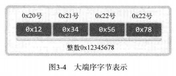
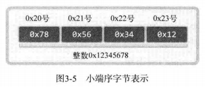

# 1 分配给套接字的IP地址与端口号

将数据传输到应用程序需要指明IP地址和端口号

UDP和TCP可以共用一个端口号

# 2 地址信息的表示

```c
struct sockaddr_in
{
    sa_family_t 	sin_family;		//地址族
    uint16_t		sin_port;		//16位TCP/UDP端口号
    struct in_addr	sin_addr;		//32位IP地址
    char			sin_zero[8];	//不使用
};

struct in_addr
{
    In_addr_t	s_addr;	//32位IPv4地址
};

struct sockaddr
{
    sa_family_t	sin_family;		// 地址族
    char		sa_data[14];	// 地址信息
}
```

| 地址族（Address family） |              含义              |
| :----------------------: | :----------------------------: |
|         AF_INET          |   IPv4网络协议中使用的地址族   |
|         AF_INET6         |   IPv6网络协议中使用的地址族   |
|         AF_LOCAL         | 本地通信中采用的UNIX协议地址族 |

- sin_port: 保存16位端口号，以网络字节序保存
- sin_addr: 保存32位IP地址信息，以网络字节序保存（32位整数）
- sin_zero: 无特殊含义。必须填充为0

# 3 网络字节序与地址转换

不同CPU保存数据的方式不同，需要考虑这个问题

## 3.1 字节序与网络字节序

CPU向内存保存数据的2种方式：

- 大端序：高位字节存放到低位地址
  
- 小端序：高位字节存放到高位地址
  

## 3.2 字节序转换

```c
/*
 * h代表主机字节序
 * n代表网络字节序
 * s指short，用于端口号转换
 * l指long，用于IP地址转换
 */
unsigned short htons(unsigned short);
unsigned short ntohs(unsigned short);
unsigned short htonls(unsigned short);
unsigned short ntohls(unsigned short);
```

# 4 网络地址的初始化和分配

```c
#include<arpa/inet.h>

// 成功返回32位大端序整数型值，失败返回INADDR_NONE
in_addr_t inet_addr(const char *string);

// 利用in_addr结构体返回32位大端序整数型值
// 成功返回1，失败返回0
int inet_aton(const char *string, struct in_addr *addr);

//将网络字节序整数型IP地址转换成字符串形式
//成功返回字符串地址值，失败返回-1
char * inet_ntoa(struct in_addr adr);
```

常见的网络地址信息初始化方法：

```c
struct sockaddr_in addr;
char *serv_ip = "211.217.168.13";	//声明IP地址字符串
char *serv_port = "9190";			//声明端口号字符串
memset(&addr, 0, sizeof(addr));		//结构体变量addr的所有成员初始化为0
addr.sin_family = AF_INET;			//指定地址族
addr.sin_addr.s_addr = inet_addr(serv_ip);	//基于字符串的IP地址初始化
/*
 * addr.sin_addr.s_addr = inet_addr(INADDR_ANY);
 * INADDR_ANY自动获取运行服务器端的计算机IP地址（仅服务器端使用）
 */
addr.sin_port = htons(atoi(serv_port));		//基于字符串的端口号初始化
```

