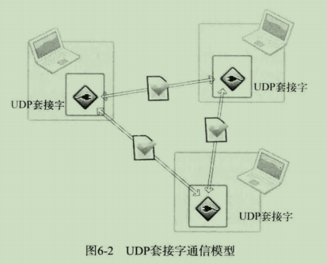

# 1 理解UDP

TCP的灵魂在于**流控制**

## 1.1 UDP内部工作原理

IP的作用是让发送端的数据包准确传递到接收端

UDP最重要的作用是根据端口号将传到主机的数据包交付给最终的UDP套接字

## 1.2 UDP的高效使用

TCP比UDP慢的原因：

- 收发数据前后进行的连接设置及清楚过程
- 收发数据过程中为保证可靠性而添加的流控制

如果收发的数据量小但需要频繁连接时（如实时视频或语音通话），UDP比TCP更高效

# 2 实现基于UDP的服务器端/客户端

UDP服务器/客户端不需要连接过程，即不必调用TCP连接过程中的listen和accept函数。UDP只有创建套接字和数据交换过程

UDP服务器端和客户端均只需1个套接字



## 2.1 基于UDP的数据I/O函数

```c
#include<sys/socket.h>

/*
 * sock		用于传输数据的UDP套接字文件
 * buff		保存待传输数据的缓冲地址值
 * nbytes	待传输的数据长度，以字节为单位
 * flags	可选参数，若没有则传递0
 * to		存有目标地址信息的sockaddr结构体变量的地址值
 * addrlen	传递给参数to的地址值结构体变量长度
 * 成功返回传输的字节数，失败返回-1
 */
ssize_t sendto(int sock, void *buff, size_t nbytes, int flags, struct sockaddr *to, socklen_t *addrlen);

/*
 * sock		用于接收数据的UDP套接字文件
 * buff		保存接收数据的缓冲地址值
 * nbytes	可接收的最大字节数，无法超过参数buff所指的缓冲大小
 * flags	可选参数，若没有则传递0
 * to		存有发送端地址信息的sockaddr结构体变量的地址值
 * addrlen	保存参数to的结构体变量长度的变量地址值
 * 成功返回传输的字节数，失败返回-1
 */
ssize_t recvfrom(int sock, void *buff, size_t nbytes, int flags, struct sockaddr *to, socklen_t addrlen);
```

## 2.2 基于UDP的回声服务器端/客户端

代码见uecho_server.c/uecho_client.c

## 2.3 UDP客户端套接字的地址分配

在TCP中，客户端调用connect函数时自动分配IP地址和端口号

在UDP中没有connect函数，所以如果调用sendto函数时发现尚未分配地址信息，则在首次调用sendto函数时给相应套接字自动分配IP和端口号，保留到程序结束为止。IP用主机IP，端口号选尚未使用的任意端口号

# 3 UDP的数据传输特性和调用connect函数

## 3.1 存在数据边界的UDP套接字

UDP时具有数据边界的协议，因此，输入函数的调用次数和输出函数的调用次数应完全一致，这样才能保证接收全部已发送数据

代码见bound_host1.c/bound_host2.c

## 3.2 已连接UDP套接字与未连接UDP套接字

sendto函数传输数据大致过程：

- 向UDP套接字注册目标IP和端口号
- 传输数据
- 删除UDP套接字中注册的目标地址信息

如果要向同一主机的同一端口传输多个数据，可以创建已连接的UDP套接字

```c
sock = socket(PF_INET, SOCK_DGRAM, 0);
memset(&adr, 0, sizeof(adr));
adr.sin_family = AF_INET;
adr.sin_addr.s_addr = ....;
adr.sin_port = ....;
connect(sock, (struct sockaddr*)&adr, sizeof(adr));
```

连接后每次调用sendto函数只需传输数据，还可以使用write和read函数