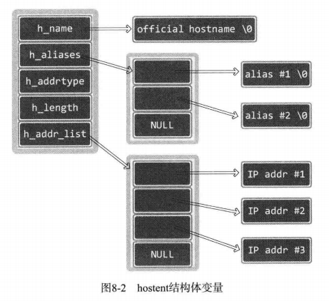

# 1 IP地址和域名之间的转换

## 1.1 利用域名获取IP地址

```c
#include<netdb.h>

struct hostent
{
    char *h_name;		//official name
    char **h_aliases;	//alias list
    int h_addrtype;		//host address type
    int h_length;		//address length
    char **h_addr_list;	//address list
}

//成功返回hostent结构体地址，失败返回NULL指针
struct hostent *gethostbyname(const char *hostname);
```



代码见gethostbyname.c

 ## 1.2 利用IP地址获取域名

```c
//成功返回hostent结构体变量地址值，失败返回NULL指针
struct hostent *gethostbyaddr(const char *addr, socklen_t len, int family);
```

代码见gethostbyaddr.c