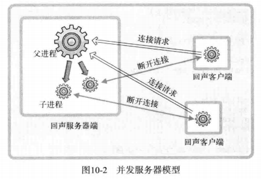

# 1 进程概念及应用

## 1.1 并发服务器的实现方法

- 多进程服务器：通过创建多个进程提供服务
- 多路复用服务器：通过捆绑并统一管理I/O对象提供服务
- 多线程服务器：通过生成与客户端等量的线程提供服务

## 1.2 理解进程

### 1.2.1 通过fork函数创建进程

```c
#include<unistd.h>

// 成功返回进程ID，失败返回-1
pid_t fork(void);
```

fork函数将创建调用的进程副本。父进程的fork函数返回子进程ID，子进程的fork函数返回0

代码见fork.c

# 2 进程和僵尸进程

进程销毁和进程创建一样重要，如果没有认真进行进程销毁，它们将变成僵尸进程造成困扰。

子进程终止后会将返回值保存到操作系统，直到父进程获取子进程的返回值时子进程才真正销毁。因此子进程需要由父进程进行回收。

## 2.1 销毁僵尸进程

```c
#include<sys/wait.h>

// 成功返回终止的子进程ID，失败返回-1
pid_t wait(int *statloc);
```

函数参数指向的单元还包含其他信息，需要通过下列宏进行分离：

- WIFEXITED：子进程正常终止时返回“真”
- WEXITSTATUS：返回子进程的返回值

wait函数会引起程序阻塞，还可以调用waitpid函数，能够防止阻塞

```c
/* pid		等待终止的目标子进程ID，若传递-1，可以等待任意子进程终止
 * statloc	与wait函数相同
 * options	传递头文件sys/wait.h中声明的常量WNOHANG，即使没有终止的子进程也不会进入阻塞状态，而是返回0并退出函数
 * 成功返回终止的子进程ID（或0），失败返回-1
 */
pid_t waitpid(pid_t, int *statloc, int options);
```

## 2.2 信号处理

父进程调用上面两个函数销毁子进程十分不优雅，而且父进程很繁忙，因此需要其他方法。操作系统知道子进程何时终止，如果当子进程终止时，操作系统能通知父进程这个消息不是很好吗。

考虑父进程写了一个zombie_handler函数，并告知操作系统，如果我创建的子进程终止了就帮我调用这个函数。这相当于“注册信号”过程。

```c
#include<signal.h>
#include<unistd.h>

// 为了在产生信号时调用，返回之前注册的函数指针
/* 
 * 参数：int signo, void (*func)(int)
 * 发生第一个参数代表的情况时，调用第二个参数所指的函数
 * signo：
 *		SIGALRM：已到通过调用alarm函数注册的时间
 *		SIGINT：输入CTRL+C
 *		SIGCHLD：子进程终止
 */
void (*signal(int signo, void (*func)(int)))(int);

// 返回0或以秒为单位的距SIGALRM信号发生所剩时间
unsigned int alarm(unsigned int seconds);
```

signal函数在UNIX系列的不同操作系统中可能存在区别，但sigaction函数完全相同。尽量使用sigaction函数。

```c
#include<signal.h>

/*
 * signo	传递信号信息
 * act		对应于第一个参数的信号处理函数信息
 * oldact	通过此参数获取之前注册的信号处理函数指针，不需要则传递0
 * 成功返回0，失败返回-1
 */
int sigaction(int signo, const struct sigaction *act, struct sigaction *oldact);

// 初始化sigaction结构体变量以调用上述函数，结构体定义如下
struct sigaction
{
    void (*sa_handler)(int);	//信号处理函数的指针值
    sigset_t sa_mask;
    int sa_flags;
}
```

代码见signal.c/sigaction.c

## 2.3 利用信号处理技术消灭僵尸进程

代码见remove_zombine.c

# 3 基于多任务的并发服务器

## 3.1 基于进程的并发服务器模型



- **第一阶段**：回声服务器端（父进程）通过调用accept函数受理连接请求
- **第二阶段**：此时获取的套接字文件描述符创建并传递给子进程
- **第三阶段**：子进程利用传递来的文件描述符提供服务